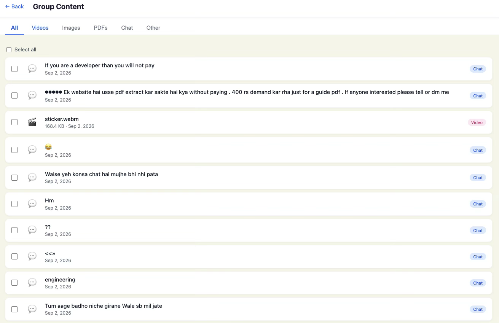

# Telegram Content Downloader (In-progress)

A full-stack web application for browsing Telegram groups/channels and viewing their shared content through a clean Angular interface.

The application uses **Angular** for the frontend and **Node.js + Express** with **GramJS** for communicating with Telegram through the MTProto protocol.

> ⚠️ **Project Status:** Authentication and content browsing are implemented. File downloading and API security are still under development.

---

## 📸 Screenshots

<p align="center">
  
  
  
</p>

---

## ✨ Features

### 🔐 Telegram Authentication

* Phone number based login
* OTP verification
* Telegram 2FA/password support
* Persistent Telegram session
* Automatically detects existing login sessions

### 📂 Telegram Groups & Channels

* Fetches the user's Telegram groups and channels
* Displays group/channel profile photos
* Pagination support
* Navigate from a group list to its detailed content

### 📄 Content Browsing

View content shared inside a Telegram group/channel.

Supported content categories:

* 🎥 Videos
* 🖼️ Images
* 📄 PDFs
* 💬 Chat / Messages
* 📦 Other files
* 📋 All content

### ☑️ Content Selection

* Select individual content items
* Bulk selection support
* Load more content without replacing existing results

### 🔗 Telegram URL Input

The home page includes a URL input for Telegram `t.me/...` links.

> The actual download functionality is currently a **TODO**.

---

# 🏗️ Project Architecture

At a high level, the application consists of three main layers:

```text
┌──────────────────────────────┐
│       User's Browser         │
│        Angular UI            │
│          :4200               │
└──────────────┬───────────────┘
               │
               │ HTTP
               │ /api/*
               ▼
┌──────────────────────────────┐
│       Node.js Backend        │
│      Express Server          │
│          :3000               │
└──────────────┬───────────────┘
               │
               │ MTProto
               ▼
┌──────────────────────────────┐
│      Telegram Servers        │
└──────────────────────────────┘
```

### Request Flow

```text
Angular Component
       │
       ▼
Angular Auth Service
       │
       ▼
HTTP Request
       │
       ▼
Express Route
       │
       ▼
Telegram Auth Service
       │
       ▼
GramJS / MTProto
       │
       ▼
Telegram
```

---

# 📁 Project Structure

```text
telegram-content-download/
│
├── server.js
├── .env
│
├── services/
│   └── user-authorization/
│       └── auth.service.js
│
├── ui/
│   ├── proxy.conf.json
│   │
│   └── src/
│       └── app/
│           ├── app.ts
│           ├── app.html
│           ├── app.routes.ts
│           │
│           ├── services/
│           │   └── auth.service.ts
│           │
│           ├── home/
│           │   ├── home.ts
│           │   └── home.html
│           │
│           └── group-detail/
│               ├── group-detail.ts
│               └── group-detail.html
│
└── resources/
    ├── image.png
    ├── image-1.png
    └── image-2.png
```

---

# ⚙️ Backend

The backend is built with **Node.js**, **Express**, and **GramJS**.

## `server.js`

Acts as the application's **HTTP server and API layer**.

Responsibilities:

* Starts the Express server on port `3000`
* Provides REST API endpoints
* Receives requests from Angular
* Calls the Telegram service
* Returns Telegram data to the frontend

### API Endpoints

| Method | Endpoint              | Description                                  |
| ------ | --------------------- | -------------------------------------------- |
| `GET`  | `/auth/status`        | Check whether the Telegram session is active |
| `POST` | `/auth/send-code`     | Send Telegram OTP                            |
| `POST` | `/auth/sign-in`       | Verify OTP and sign in                       |
| `POST` | `/auth/2fa`           | Submit Telegram 2FA password                 |
| `GET`  | `/groups`             | Get Telegram groups/channels                 |
| `GET`  | `/groups/:id/photo`   | Get group/channel profile photo              |
| `GET`  | `/groups/:id/content` | Get content from a group/channel             |
| `POST` | `/download`           | Download endpoint — **TODO**                 |

---

## `auth.service.js`

Location:

```text
services/user-authorization/auth.service.js
```

This is the **Telegram communication layer** of the application.

It uses **GramJS** to communicate directly with Telegram using the MTProto protocol.

### Main responsibilities

* Creates and manages a Telegram client
* Handles Telegram authentication
* Maintains the Telegram session
* Retrieves groups/channels
* Retrieves group/channel profile photos
* Retrieves messages and files
* Categorizes content

### Telegram Login Flow

```text
Phone Number
     │
     ▼
sendCode()
     │
     ▼
Telegram sends OTP
     │
     ▼
signIn()
     │
     ├── Login successful
     │
     └── 2FA required
              │
              ▼
        signInWith2FA()
              │
              ▼
        Login successful
```

The authenticated session is stored as a session string so that the user does not have to log in again every time the backend restarts.

---

# 🔑 Environment Variables

The backend requires Telegram API credentials.

Example `.env`:

```env
API_ID=your_api_id
API_HASH=your_api_hash
SESSION_STRING=your_session_string
```

### Variables

| Variable         | Purpose                           |
| ---------------- | --------------------------------- |
| `API_ID`         | Telegram application ID           |
| `API_HASH`       | Telegram application hash         |
| `SESSION_STRING` | Persistent Telegram login session |

> 🔒 **Never commit your ****`.env`**** file or Telegram credentials to Git.**

Add it to `.gitignore`:

```gitignore
.env
node_modules/
```

---

# 🖥️ Frontend

The frontend is built using **Angular**.

## `proxy.conf.json`

During development:

```text
Angular
localhost:4200
     │
     │ /api/*
     ▼
Node.js
localhost:3000
```

The Angular development server forwards `/api/...` requests to the Node.js backend.

For example:

```text
Angular calls:

/api/groups

        ↓

Proxy forwards to:

http://localhost:3000/groups
```

This allows the frontend to communicate with the backend without directly hardcoding the backend URL in every component.

---

# 🧩 Angular Application

## `app.ts` / `app.html`

The root component and authentication gate.

When the application starts:

```text
Application starts
       │
       ▼
Check /api/auth/status
       │
       ├── Logged in
       │      │
       │      ▼
       │   Home Page
       │
       └── Not logged in
              │
              ▼
          Login Screen
```

The login screen guides the user through:

1. Phone number
2. OTP
3. Optional 2FA password

The application then navigates to the home page after successful authentication.

---

## `app.routes.ts`

Defines application routes.

| Route             | Component              | Purpose                    |
| ----------------- | ---------------------- | -------------------------- |
| `/`               | `HomeComponent`        | Groups/channels home page  |
| `/group/:groupId` | `GroupDetailComponent` | View group/channel content |

---

## `services/auth.service.ts`

A shared Angular service responsible for communicating with the backend.

It:

* Wraps Angular `HttpClient`
* Handles authentication API calls
* Retrieves groups
* Retrieves group content
* Retrieves profile photos
* Defines `Group` and `ContentItem` TypeScript interfaces

Components use this service instead of making API calls directly.

```text
Component
    │
    ▼
AuthService
    │
    ▼
Backend API
```

This keeps API-related code in one place.

---

# 🏠 Home Page

Files:

```text
ui/src/app/home/
├── home.ts
└── home.html
```

The home page:

* Displays Telegram groups/channels
* Loads group profile photos
* Supports pagination
* Displays 10 groups per page
* Provides previous/next navigation
* Provides a Telegram URL input
* Navigates to a group's detail page

```text
Home
 │
 ├── Groups
 │    ├── Group A
 │    ├── Group B
 │    ├── Group C
 │    └── ...
 │
 └── Telegram URL
```

---

# 📦 Group Detail Page

Files:

```text
ui/src/app/group-detail/
├── group-detail.ts
└── group-detail.html
```

The group detail page displays content from a selected Telegram group/channel.

### Content Tabs

```text
┌─────┬────────┬────────┬──────┬──────┬───────┐
│ All │ Videos │ Images │ PDFs │ Chat │ Other │
└─────┴────────┴────────┴──────┴──────┴───────┘
```

Features:

* Filter content by type
* Select individual items
* Bulk selection
* Load more content
* Append new content instead of replacing existing items

---

# 🔄 End-to-End Flow

## 1. Application Startup

```text
Browser
   │
   ▼
Angular App
   │
   ▼
/api/auth/status
   │
   ▼
Backend
   │
   ▼
Telegram Session
```

The application determines whether the user already has an active Telegram session.

---

## 2. Login

```text
Phone Number
     │
     ▼
POST /auth/send-code
     │
     ▼
Telegram OTP
     │
     ▼
POST /auth/sign-in
     │
     ├── Success ──────────────┐
     │                         │
     └── 2FA Required          │
            │                  │
            ▼                  │
       POST /auth/2fa          │
            │                  │
            └──────────────────┘
                       │
                       ▼
                  Home Page
```

---

## 3. Load Groups

```text
HomeComponent
      │
      ▼
GET /groups
      │
      ▼
auth.service.js
      │
      ▼
GramJS
      │
      ▼
Telegram
      │
      ▼
Groups / Channels
      │
      ▼
Angular UI
```

---

## 4. View Group Content

```text
User selects group
        │
        ▼
/group/:groupId
        │
        ▼
GET /groups/:id/content
        │
        ▼
GramJS
        │
        ▼
Telegram
        │
        ▼
Messages + Files
        │
        ▼
Content categorization
        │
        ▼
Angular UI
```

---

# 🛠️ Tech Stack

### Frontend

* Angular
* TypeScript
* HTML / CSS
* Angular Router
* Angular HttpClient

### Backend

* Node.js
* Express
* JavaScript

### Telegram

* GramJS
* Telegram MTProto API

### Development

* Angular development server
* Express server
* Angular proxy

---

# 🚧 Current Status

| Feature                     | Status |
| --------------------------- | :----: |
| Telegram authentication     |    ✅   |
| OTP login                   |    ✅   |
| Telegram 2FA                |    ✅   |
| Persistent session          |    ✅   |
| Group/channel listing       |    ✅   |
| Group profile photos        |    ✅   |
| Group content retrieval     |    ✅   |
| Content categorization      |    ✅   |
| Content filtering           |    ✅   |
| Pagination                  |    ✅   |
| Load more                   |    ✅   |
| Content selection           |    ✅   |
| Telegram URL input          |   🟡   |
| File downloading            |    ❌   |
| Bulk download               |    ❌   |
| API authentication/security |    ❌   |

---

# 🚀 Planned Improvements

* [ ] Implement actual file downloading
* [ ] Implement bulk downloads
* [ ] Support Telegram `t.me/...` URL downloads
* [ ] Add download progress indicators
* [ ] Add download history
* [ ] Improve error handling
* [ ] Add API authentication
* [ ] Secure session storage
* [ ] Add rate limiting
* [ ] Improve responsive UI
* [ ] Add proper production deployment configuration

---

# ⚠️ Security Notice

This project currently does **not** have authentication or authorization protection on the backend API.

Anyone who can access the Node.js server may potentially access the Telegram data available through the API.

For example:

```text
Client
   │
   ▼
Node.js :3000
   │
   ├── /groups
   ├── /groups/:id/content
   └── /download
```

Before using this application in a production or publicly accessible environment, implement:

* API authentication
* Authorization
* Secure session storage
* HTTPS
* Rate limiting
* Input validation
* Proper CORS configuration
* Secure environment variable management

---

# 📌 Important

This project is intended for accessing content from Telegram accounts that the authenticated user is authorized to access.

Users are responsible for complying with Telegram's terms, applicable laws, and the rights of content owners when downloading or using content.

---

# 📄 License

Add your preferred license here.

For example:

```text
MIT License
```

---

## 👨‍💻 Development

Contributions, improvements, and suggestions are welcome.

If you find a bug or have an idea for a feature, feel free to open an issue or submit a pull request.
