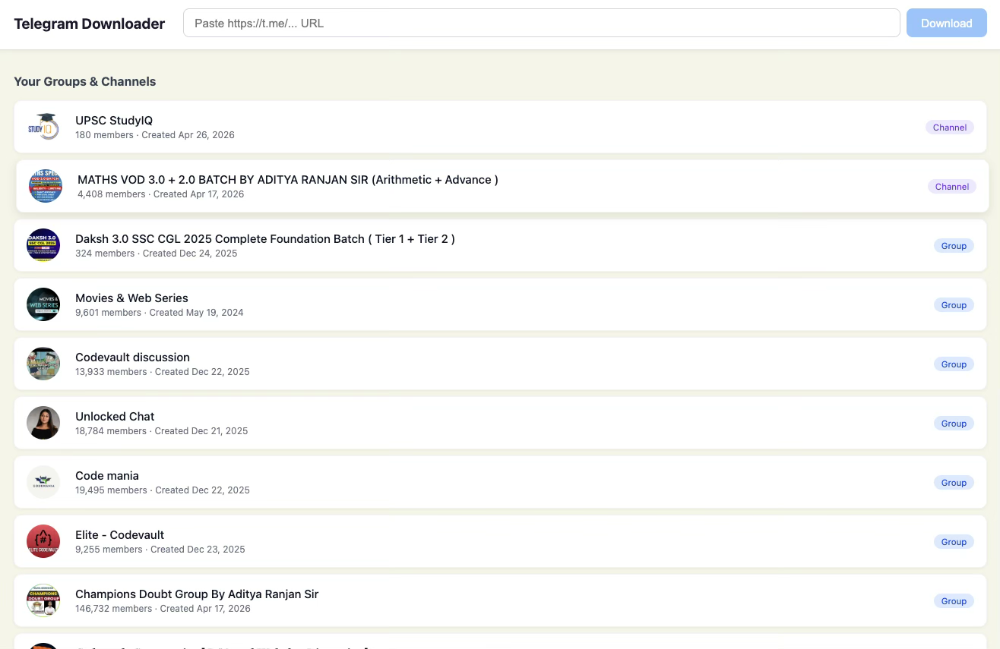
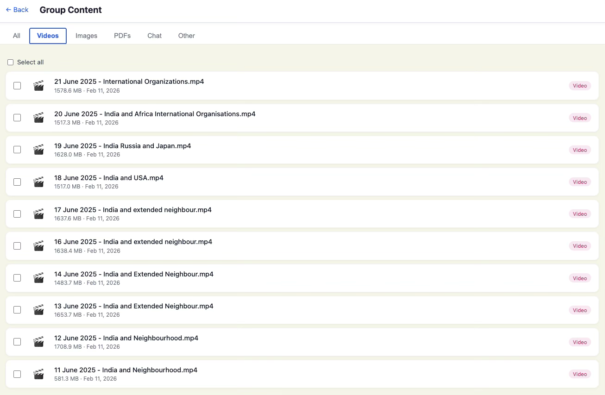

# telegram-content-download

Go to my.telegram.org → log in → API development tools
Create an app → copy App api_id → paste as API_ID
Copy App api_hash → paste as API_HASH
Leave SESSION_STRING empty for now — after first login via the UI, copy the sessionString from the server response and paste it here